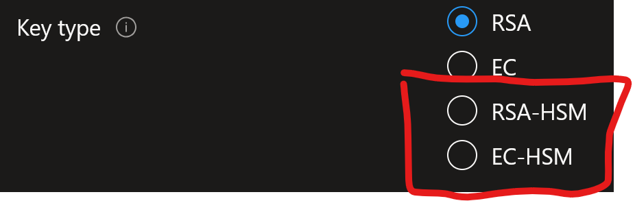

# Develop code that uses keys, secrets, and certificates stored in Azure Key Vault

# About Azure Key Vault

A key vault can either be a "vault", or a "Managed HSM pool". This is decided upon creation:
* Managed Hardware Security Module (HSM) pools: Stores only HMS keys. Requires premium tier, and has an hourly usage fee of €2.813 pr. hour(!) at time of writing.
* Vaults can contain:
   * Secrets (tokens, passwords, certificates, API keys, and other secrets)
   * Keys: used to encrypt and protect your data. Both software and HSM keys can be stored. HSM keys requires premium tier. The image below shows the two HSM key types that can be created in a premium SKU key vault. 
       
   * Certificates: provision, manage, and deploy public and private TSL/ SSL certificates

# Authentication and authorization
Authentication is done via Microsoft Entra ID. 

Authorization may be done via:
* Azure role-based access control: Can be used for both vault management and vault access.
* Key Vault access policy (legacy!): Can only be used for vault access.

Sources
* About Keyvault: https://learn.microsoft.com/en-us/training/modules/implement-azure-key-vault/2-key-vault-overview

⬅️ [Return to Implement Azure security](README.md)

⬅️ [Return to Table of Contents](../README.md)